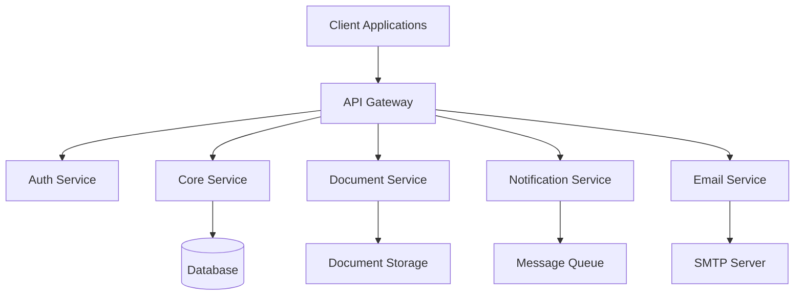

# System Architecture

## Overview

CompliTracker is built on a microservices architecture, designed for scalability, maintainability, and reliability. The system consists of multiple independent services that work together to provide a comprehensive compliance tracking solution.

## Architecture Diagram

## Component Description

### API Gateway
- Entry point for all client requests
- Handles request routing and load balancing
- Implements API rate limiting and security policies
- Manages service discovery and circuit breaking

### Authentication Service
- User authentication and authorization
- Token management (JWT)
- User session handling
- Role-based access control (RBAC)

### Core Service
- Business logic implementation
- Compliance rules engine
- Data processing and validation
- Reporting and analytics

### Document Service
- Document upload and storage management
- Version control for documents
- Document metadata management
- File format validation and conversion

### Notification Service
- Real-time notifications
- Event processing
- Notification preferences management
- Multi-channel notification delivery

### Email Service
- Email template management
- Email queue processing
- Delivery status tracking
- Bounce handling

## Data Flow

1. Client requests are received by the API Gateway
2. API Gateway authenticates requests through Auth Service
3. Validated requests are routed to appropriate services
4. Services process requests and store/retrieve data as needed
5. Notifications are triggered through the Notification Service
6. Email notifications are handled by the Email Service

## Security Architecture

- JWT-based authentication
- SSL/TLS encryption for all communications
- Role-based access control
- API key management
- Rate limiting and DDoS protection

## Scalability

- Horizontal scaling of individual services
- Load balancing across service instances
- Caching strategies
- Database sharding capabilities

## Monitoring and Logging

- Centralized logging system
- Prometheus metrics collection
- Grafana dashboards
- Health check endpoints
- Performance monitoring

## Disaster Recovery

- Regular data backups
- Service redundancy
- Failover mechanisms
- Data replication strategies

## Technology Stack

- Frontend: React
- Backend: Spring Boot
- Database: PostgreSQL
- Message Queue: RabbitMQ
- Container Platform: Docker
- Orchestration: Kubernetes
- Monitoring: Prometheus & Grafana